## Overview

This repository hosts the code and data (i.e., ontologies) associated with the paper titled **"Bridging the Scientific Knowledge Gap and Reproducibility: A Survey of Provenance, Assertion, and Evidence Ontologies"**. The paper has been accepted to [The Web Conference](https://www2025.thewebconf.org/).

If you find this resource valuable and use it into your work, please consider citing it using the following reference:

```
@inproceedings{chhetri2025bridging,
  title = {Bridging the Scientific Knowledge Gap and Reproducibility: A Survey of Provenance, Assertion and Evidence Ontologies},
  author = {
    Tek Raj Chhetri and
    Yaroslav O. Halchenko and
    Dorota Jarecka and
    Puja Trivedi and
    Satrajit Ghosh and
    Patrick Ray and
    Lydia Ng
  },
  booktitle = {Companion Proceedings of the ACM Web Conference 2025 (to appear)},
  year = {2025},
  publisher = {ACM},
  address = {Sydney, NSW, Australia}, 
  doi = {10.1145/3701716.3715483},
  isbn = {979-8-4007-1331-6/25/04},
  conference = {ACM Web Conference 2025},
  location = {Sydney, NSW, Australia},
  month = {April 28-May 2}, 
}
```

## Contents

- **Data:** Contains ontologies related to assertions and evidence. These ontologies provide the necessary modeling to record the assertions and evidence from the various sources, such as scientific publications, experimentation (wet lab).
- **Code:** Includes Jupyter Notebook code used for analyzing the ontologies.

## List of Ontologies
| Acronym    | Full Name                                                                     |
|------------|--------------------------------------------------|
| ECO      | Evidence and Conclusion Ontology      |
|SIO|Semanticscience Integrated Ontology|
|RDO|Reasoning and Discourse Ontology|
|SEPIO|Scientific Evidence and Provenance Information Ontology|
|AMO|Argument Model Ontology|
|ARGO|Arguments Ontology|
|SWAN|Semantic Web Applications in Neuromedicine Ontology|
|EXPO|Ontology of scientific experiments|
|OBI|Ontology for Biomedical Investigations|
| Nanopublication|Nanopublications template ontology|
|HOH|Hierarchies of Hypotheses Ontology|
|EVI|Evidence Graph Ontology|
|RVO | Research Variable Ontology|
|PAV|PAV ontology: provenance, authoring and versioning|
|OPMW-PROV|The Open Provenance Model for Workflows|
|PROV-O|The PROV (provenance) Ontology|
|P-Plan|[Ontology for Provenance and Plans](https://vocab.linkeddata.es/p-plan/index.html)|
| PMLM |Provenance for Machine Learning Models (PMLM) ontology | 
| NeuroBridge | NeuroBridge ontology| 
| ProPreO | Proteomics Data and Process Provenance Ontology (ProPreO)| 
|POEM | Psychometric Ontology of Experiences and Measures| 
| PMLM| [PMLM Ontology](https://knowledgecaptureanddiscovery.github.io/pmlm/mlprov/release/0.0.1/index.html)|
|OPMW (or OPMW-PROV)| [Open Provenance Model for Workflows](https://www.opmw.org/index.html)|
|HED|[Hierarchical Event Descriptors Ontology](https://github.com/hed-standard/hed-schemas)|
|REPRODUCE-ME|[REPRODUCE-ME Ontology](https://bioportal.bioontology.org/ontologies/REPRODUCE-ME)|
## List of re-used ontologies

The table below lists ontologies that have been reused by others, such as ECO, which supports the recording of assertions and evidence.

| Acronym    | Full Name                                        | Link                                     |
|------------|--------------------------------------------------|------------------------------------------|
| CHEBI      | Chemical Entities of Biological Interest         |[https://www.ebi.ac.uk/chebi/](https://www.ebi.ac.uk/chebi/)                                          |
| GO         | Gene Ontology                                    |  [https://geneontology.org/docs/ontology-documentation/](https://geneontology.org/docs/ontology-documentation/)                                        |
| DC/DC-TERMS        | Dublin Core Metadata Initiative                  |  [https://www.dublincore.org/specifications/dublin-core/](https://www.dublincore.org/specifications/dublin-core/)                                        |
| NCBITAXON  | NCBI Organismal Classification                   | [https://www.ncbi.nlm.nih.gov/taxonomy](https://www.ncbi.nlm.nih.gov/taxonomy)                                         |
| OMRSE      | Ontology for Modeling and Representation of Social Entities  | [https://www.ebi.ac.uk/ols4/ontologies/omrse](https://www.ebi.ac.uk/ols4/ontologies/omrse)                                         |
| UBERON     | Uberon Multi-Species Anatomy Ontology            |  [https://obofoundry.org/ontology/uberon.html](https://obofoundry.org/ontology/uberon.html)                                        |
| VO         | Vaccine Ontology                                 |  [https://www.ebi.ac.uk/ols4/ontologies/vo](https://www.ebi.ac.uk/ols4/ontologies/vo)                                        |
| IAO        | Information Artifact Ontology                    | [https://obofoundry.org/ontology/iao.html](https://obofoundry.org/ontology/iao.html)                                         |
| SO         | Sequence Ontology                                |  [http://www.sequenceontology.org/](http://www.sequenceontology.org/)                                        |
| PR         | Protein Ontology                                 | [https://www.ebi.ac.uk/ols4/ontologies/pr](https://www.ebi.ac.uk/ols4/ontologies/pr)                                         |                                        |
| CLO        | Cell Line Ontology                               | [https://bioportal.bioontology.org/ontologies/CLO](https://bioportal.bioontology.org/ontologies/CLO)                                         |
| OMO        | OBO Metadata Ontology     | [https://github.com/information-artifact-ontology/ontology-metadata](https://github.com/information-artifact-ontology/ontology-metadata)                                         |
| OGMS       | Ontology for General Medical Science            |  [https://github.com/OGMS/ogms](https://github.com/OGMS/ogms)                                        |
| HP         | Human Phenotype Ontology                         |  [https://hpo.jax.org/](https://hpo.jax.org/)                                        |
| IDO        | Infectious Disease Ontology                      |  [https://github.com/infectious-disease-ontology/infectious-disease-ontology](https://github.com/infectious-disease-ontology/infectious-disease-ontology)                                        |
| OPL        | Ontology for Parasite Lifecycle                  |                                          [https://bioportal.bioontology.org/ontologies/OPL/](https://bioportal.bioontology.org/ontologies/OPL/)|
| OIO        | Ontology of Biomedical Investigations Ontology of Individuals |  [https://www.ebi.ac.uk/ols4/ontologies/oio](https://www.ebi.ac.uk/ols4/ontologies/oio)                        |
| OBA        | Ontology of Biological Attributes                |  [https://github.com/obophenotype/bio-attribute-ontology](https://github.com/obophenotype/bio-attribute-ontology)                                        |
| PATO       | Phenotype And Trait OntologyPhenotype And Trait Ontology                    |    [https://github.com/pato-ontology/pato](https://github.com/pato-ontology/pato)                                      |
| CL         | Cell Ontology                                    |  [https://obofoundry.org/ontology/cl.html](https://obofoundry.org/ontology/cl.html)                                        |
| BFO        | Basic Formal Ontology                            |  [https://basic-formal-ontology.org/](https://basic-formal-ontology.org/)                                        |
| RO         | Relation Ontology                                |[https://github.com/oborel/obo-relations](https://github.com/oborel/obo-relations)                                          |
| COB        | Core Ontology for Biology and Biomedicine       | [https://bioportal.bioontology.org/ontologies/COB](https://bioportal.bioontology.org/ontologies/COB)                                         |
| ENVO       | Environment Ontology                             | [https://sites.google.com/site/environmentontology/](https://sites.google.com/site/environmentontology/)                                         |
| UO         | Units of Measurement Ontology                    | [https://github.com/bio-ontology-research-group/unit-ontology](https://github.com/bio-ontology-research-group/unit-ontology)                                          |
| CHMO       | Chemical Methods Ontology                        |  [https://github.com/rsc-ontologies/rsc-cmo](https://github.com/rsc-ontologies/rsc-cmo)                                        |
| MRO        | Molecular Role Ontology                          | [https://github.com/IEDB/MRO](https://github.com/IEDB/MRO)                                          |
| OBI        | Ontology for Biomedical Investigations           | [https://www.ebi.ac.uk/ols4/ontologies/obi](https://www.ebi.ac.uk/ols4/ontologies/obi)                                          |
| STATO      | Statistical Methods Ontology                     |  [https://github.com/ISA-tools/stato](https://github.com/ISA-tools/stato)                                        |
| PROV-O     | Provenance Ontology                              |  [https://www.w3.org/TR/prov-o/](https://www.w3.org/TR/prov-o/)                                        |
| INFO       | Information Entity Ontology                            |                                          |
| FOAF       | Friend of a Friend Ontology                      | [http://xmlns.com/foaf/spec/](http://xmlns.com/foaf/spec/)                                         |
| CiTO       | Citation Typing Ontology                         | [https://sparontologies.github.io/cito/current/cito.html](https://sparontologies.github.io/cito/current/cito.html)                                         |
| SKOS       | Simple Knowledge Organization System             | [https://www.w3.org/2004/02/skos/](https://www.w3.org/2004/02/skos/)                                         |
| VANN       | Vocabulary Annotation Ontology                   |  [https://vocab.org/vann/](https://vocab.org/vann/)                                        |                                       
|Taxslim|Subset of NCBITAXON | - |
|DAML| DARPA Agent Markup Language (DAML+OIL)|[https://www.daml.org/](https://www.daml.org/)|
|vcard|vCard Ontology - for describing People and Organizations|[https://www.w3.org/TR/vcard-rdf/](https://www.w3.org/TR/vcard-rdf/)|
|SWRLA|SWRL Annotations|[http://swrl.stanford.edu/ontologies/3.3/swrla.owl](http://swrl.stanford.edu/ontologies/3.3/swrla.owl)|
|PROV-O| Provenance ontology | [https://www.w3.org/TR/prov-o/](https://www.w3.org/TR/prov-o/)|
|Schema.org|Schema.org |[https://schema.org/](https://schema.org/) |
|Bioschemas| Bioschemas | [https://bioschemas.org/](https://bioschemas.org/)|
| FaBiO| FRBR-aligned Bibliographic Ontology| [https://sparontologies.github.io/fabio/current/fabio.html](https://sparontologies.github.io/fabio/current/fabio.html)|
|DBpedia|DBpedia resource|[http://dbpedia.org/resource](http://dbpedia.org/resource)|
| HADatAC | HADatAC Vocabulary and Ontology Infrastructure (VSTOI)|[https://www.hadatac.org/ontologies](https://www.hadatac.org/ontologies)|
| SNOMEDCT |SNOMED CT clinical terms | [https://bioportal.bioontology.org/ontologies/SNOMEDCT?p=summary](https://bioportal.bioontology.org/ontologies/SNOMEDCT?p=summary)|
|OPMO| Open Provenance Model Vocabulary | [https://open-biomed.sourceforge.net/opmv/ns.html](https://open-biomed.sourceforge.net/opmv/ns.html)|
|OPMV|Open Provenance Model Vocabulary| [https://open-biomed.sourceforge.net/opmv/opmv-guide.html](https://open-biomed.sourceforge.net/opmv/opmv-guide.html)|
|PROVCARE| ProvCaRe ontology| [https://provcare.case.edu](https://provcare.case.edu) |


## Mermaid Diagram

The mermaid diagram below illustrates a graphical representation of the ontologies that were reused.

#### Assertion/Evidence ontolgy 
[Click here to view the image in a larger size.](https://raw.githubusercontent.com/sensein/assertion-evidence-paper/3a45ca647682d11f623db19fbdd6441094d6aa0a/assertion-evidence-graph.svg?token=AMOUTDS576ROLHLKS2CKGETHJYPKO)


#### Provenance ontolgy 
[Click here to view the image in a larger size.](https://raw.githubusercontent.com/sensein/assertion-evidence-paper/3a45ca647682d11f623db19fbdd6441094d6aa0a/provenance-graph.svg?token=AMOUTDR7KDBQEJ776DQTXK3HJYPJQ)





## Contact
- Tek Raj Chhetri <tekraj@mit.edu>

## Acknowledgement 
This work is supported by: 1U24MH130918-01 (BICAN knowledge base), NIH-NIBIB P41 EB019936 (ReproNim) and NIH-NIMH R24 MH117295 (DANDI). 

## License
[](https://creativecommons.org/licenses/by/4.0/)  
This work is licensed under a [Creative Commons Attribution 4.0 International (CC BY 4.0) License](https://creativecommons.org/licenses/by/4.0/).

